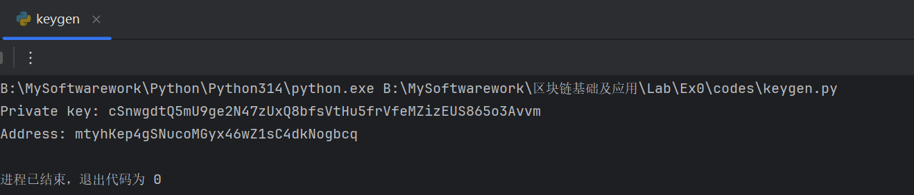
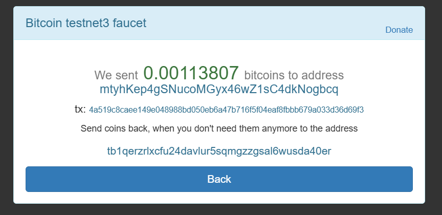
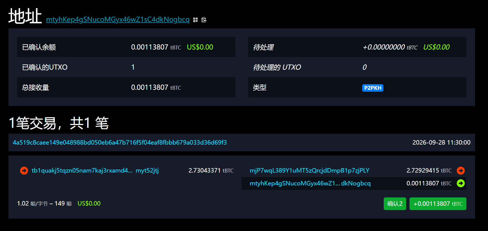
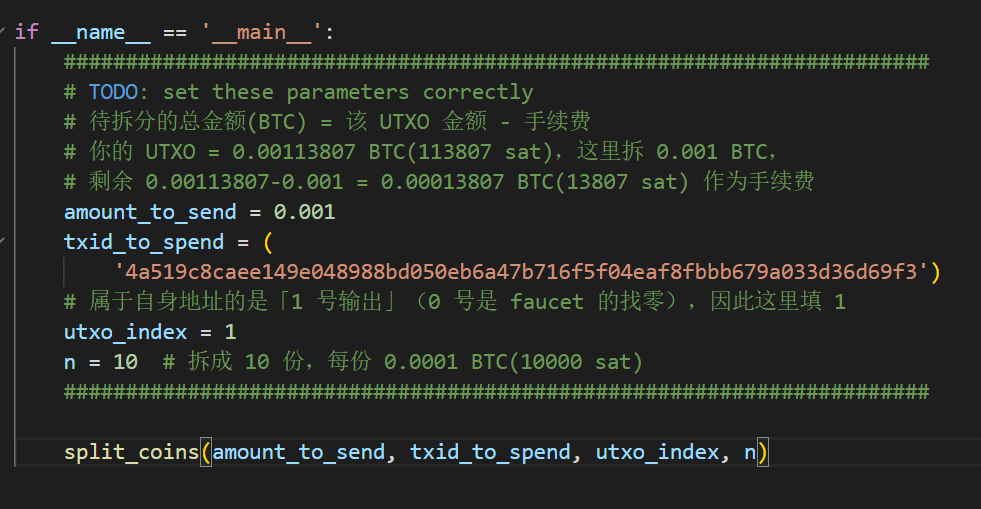
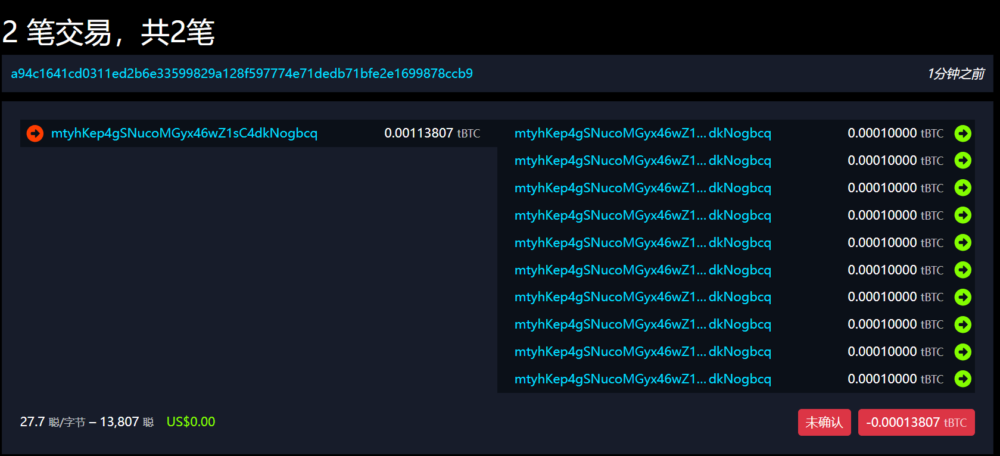
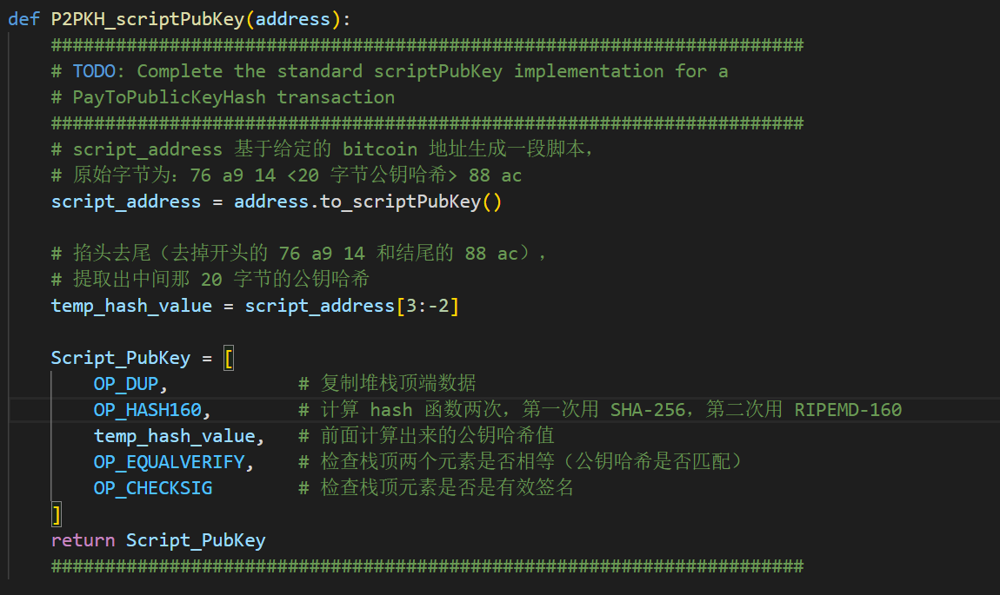
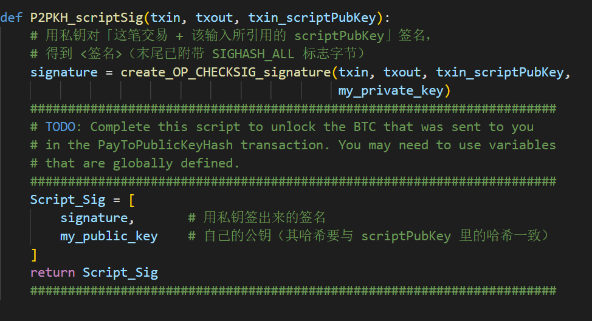
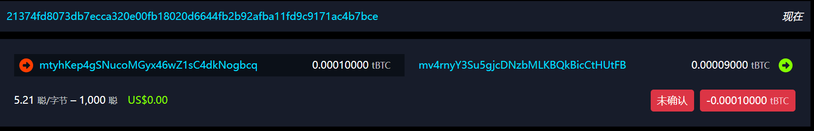

# 《区块链基础及应用》Ex0-Ex1实验报告

学院：计算机及网络空间安全学院　　专业：计算机科学与技术　　姓名：李梦涛　　学号：2412483

## Ex1

### 一、项目构成

github地址：https://github.com/KaGaMi9999/BlockchainsNKU2026

Blockchains

- Lab
  - Ex0（预备实验）
    - codes
      - keygen.py：生成私钥和地址
    - documents
      - ObtainTestcoin：解压后的文件夹（含环境配置说明.txt、keygen.py、老师下发的说明 PDF）
      - ObtainTestcoin.rar：老师下发的压缩包
    - Myreports
      - 信息.txt：生成的私钥、地址与领币记录
      - 密钥生成.png：运行 keygen.py 脚本的结果
      - 账户信息.png：领取完 bitcoin 后的账户信息
      - 领币.png：预备实验中的领取记录
  - Ex1
    - codes
      - config.py：修改了私钥
      - ex1.py：完成了发币的操作
      - keygen.py：生成私钥和地址
      - requirements.txt：环境要求
      - split_test_coins .py：完成了分币的操作
      - utils.py：修改了广播节点
    - documents
      - Ex1：解压后的文件夹
      - Ex1.rar：老师下发的压缩包
    - MyReports
      - BlockChain-Ex0-Ex1-2412483.md：撰写的实验报告
      - BlockChain-Ex0-Ex1-2412483.pdf：实验报告的 PDF 版本
      - P2PKH_scriptPubkey.png：P2PKH_scriptPubKey 函数的实现
      - P2PKH_scripSig.png：P2PKH_scriptSig 函数的实现
      - 分币操作参数.png：split_test_coins .py 中 main 函数的参数配置
      - 分币操作交易记录.png：运行 split_test_coins .py 脚本的结果
      - 发放货币交易记录.png：运行 ex1.py 脚本的结果

<br>

### 二、实验内容

#### 步骤 0（预备实验 Ex0）：配置环境并生成密钥

在正式做 Ex1 之前，需要先完成预备实验 Ex0：一是把运行环境配好，二是为自己生成一对密钥。

首先是环境的配置。按照 documents/ObtainTestcoin 下的《环境配置说明.txt》，在运行 keygen.py 之前，需要先安装 python-bitcoinlib 包：

```bash
pip install python-bitcoinlib
```

环境准备好之后，我们运行 codes 目录下的 keygen.py 来生成私钥和地址。该脚本的代码如下所示：

```python
from os import urandom
from bitcoin import SelectParams
from bitcoin.wallet import CBitcoinSecret, P2PKHBitcoinAddress

SelectParams('testnet')

seckey = CBitcoinSecret.from_secret_bytes(urandom(32))

print("Private key: %s" % seckey)
print("Address: %s" %
      P2PKHBitcoinAddress.from_pubkey(seckey.pub))
```

可以看到，脚本首先通过 `SelectParams('testnet')` 声明后面的操作全部在比特币测试网（而不是主网）上进行，这一步很重要，否则算出来的地址前缀和接下来的广播接口都会对不上；接着用 `os.urandom(32)` 生成 32 字节的随机数作为私钥的原始字节，封装成 `CBitcoinSecret` 对象；最后从私钥推导出公钥，再由公钥算出 P2PKH 地址并打印。

运行结果如下所示：



本次生成的私钥与地址为：

- Private key：cSnwgdtQ5mU9ge2N47zUxQ8bfsVtHu5frVfeMZizEUS865o3Avvm
- Address：mtyhKep4gSNucoMGyx46wZ1sC4dkNogbcq

为了后面做实验时不再重复生成，我把这些信息记录在了 `Myreports/信息.txt` 中。地址里开头的 `m` 以及私钥开头的 `c` 都是 testnet 的编码前缀。

<br>

#### 步骤 1：领取 bitcoins

首先，我们根据预备实验，在 Bitcoin testnet3 faucet 网站上领取了我们的 bitcoins，把上一步生成的地址 `mtyhKep4gSNucoMGyx46wZ1sC4dkNogbcq` 粘贴进去。领取结果如下所示：



bitcoins 的相关信息如下所示：

- tx：4a519c8cae149e048988bd050eb6a47b716f5f04eaf8fbbb679a033d36d69f3
- address：mtyhKep4gSNucoMGyx46wZ1sC4dkNogbcq
- private key：cSnwgdtQ5mU9ge2N47zUxQ8bfsVtHu5frVfeMZizEUS865o3Avvm
- 回退地址：tb1qerzrlxcfu24davlur5sqmgzzgsal6wusda40er

从 faucet 返回的页面可以看到，我们一共领取到了 **0.00113807** 个 bitcoin，对应的交易哈希（tx）为 `4a519c8cae149e048988bd050eb6a47b716f5f04eaf8fbbb679a033d36d69f3`。页面下方还给出了「用完之后请把币退回」的地址，也就是上面记录的回退地址。

目前我们账户下所拥有的 bitcoins 如下图所示：



从链上浏览器上可以看到，这笔交易共有 2 个输出：faucet 是从一个金额为 2.73043371 tBTC 的输入里，把 2.72929415 tBTC 找零给自己，剩下的 **0.00113807** tBTC 写在了 **1 号输出**上给到我们。所以我们账户的状态是：已确认余额 0.00113807 tBTC、已确认的 UTXO 数量为 1、类型为 P2PKH，且这笔交易已经获得了 2 个确认。

<br>

#### 步骤 2：分块 bitcoins

在领取完 bitcoins 之后，我们通过编写程序来完成对 bitcoins 的分块。

在分块之前，首先我们要填写一些相关的地址信息。我们打开 config.py 文件，将私钥替换成我们自己的私钥，同时确认老师收币的地址：

```python
#将预备实验中的创建的私钥(private key)写入
my_private_key = CBitcoinSecret(
    'cSnwgdtQ5mU9ge2N47zUxQ8bfsVtHu5frVfeMZizEUS865o3Avvm')

my_public_key = my_private_key.pub
my_address = P2PKHBitcoinAddress.from_pubkey(my_public_key)

#the teacher SuMing's address
faucet_address = CBitcoinAddress('mv4rnyY3Su5gjcDNzbMLKBQkBicCtHUtFB')
```

其中 `my_address` 是由我们自己的私钥推导出来的地址，`faucet_address` 则是老师用来收币的地址，最后发币那一步会把币发到这里。

然后我们打开 split_test_coins .py 文件，开始正式的分币工作。split_coins 函数已经帮我们写好，因此我们只需要完成 main 函数的部分即可。

我们给出填写的值的含义：

- amount_to_send：就是我们一共需要花费的 bitcoins 的数量。由于我们一共领取到了 0.00113807 个 bitcoins，所以在此处我们选择花费 0.001 个 bitcoins，剩下 0.00013807 个留给矿工作为手续费
- txid_to_spend：就是我们之前领取 bitcoins 时的 tx 值
- utxo_index：就是我们这笔钱所在输出的下标。这里要特别注意，0 号输出是 faucet 自己的找零，属于我们地址的是 **1 号输出**，因此这里填 **1**
- n：就是我们规定的分块的数量，按照课上所说，我们要将其拆分成 10 份，因此 n=10，每一份是 0.0001 个 bitcoins

具体代码如下所示：



紧接着下面就是 split_coins 函数的调用：

```python
    split_coins(amount_to_send, txid_to_spend, utxo_index, n)
```

运行程序，就会输出我们的分块结果。下面是链上浏览器上的截图，可以说明我们已经成功完成了对 bitcoin 的分块操作：



从截图中可以看到，这笔交易把 **0.00113807** tBTC 作为输入，拆分成了 **10 个**金额各为 **0.00010000** tBTC 的输出，差额 0.00013807 tBTC（13807 聪）作为手续费，费率为 27.7 聪/字节。分块后的交易哈希为：

```
a94c1641cd0311ed2b6e33599829a128f597774e71dedb71bfe2e1699878ccb9
```

这笔交易产生的 10 个输出下标依次是 0~9，正好对应后面 10 次发币操作。

<br>

#### 步骤 3：发放 bitcoins

分完 bitcoin 之后，我们就要进行对应的发放工作，此处我们主要填写 ex1.py 文件中的代码。

我们需要补全的有：

- P2PKH_scriptPubKey 函数
- P2PKH_scriptSig 函数
- main 函数

**P2PKH_scriptPubKey 函数**

我们上网查询可知，该函数用于生成一个标准的交易输出脚本，根据课本第三章的内容可以知道，该部分由以下部分构成：

- OP_DUP：复制堆栈顶端数据
- OP_HASH160：计算 hash 函数两次，第一次用 SHA-256，第二次用 RIPEMD-160
- temp_hash_value：前面计算出来的公钥 hash 值
- OP_EQUALVERIFY：检查栈顶两个元素是否相等，是一个 bool 值
- OP_CHECKSIG：检查栈顶元素是否是有效签名

我们根据以上信息，编写出对应的函数，如下所示：



可以看到，函数首先输入一个地址，然后利用 to_scriptPubKey 函数将其转化为脚本地址，接着提取出公钥 hash 的值。具体来说，`address.to_scriptPubKey()` 返回的原始字节是 `76 a9 14 <20 字节公钥哈希> 88 ac`，其中 `76` 是 OP_DUP、`a9` 是 OP_HASH160、`14` 是后面压入数据的长度、`88` 是 OP_EQUALVERIFY、`ac` 是 OP_CHECKSIG，所以用 `script_address[3:-2]` 掐头去尾，就能取出中间那 20 字节的公钥哈希。我们输出的 Script_PubKey 主要由五部分构成：堆栈顶端的数据、计算出的 hash 函数、前面算出的公钥 hash 值、比较栈顶元素是否相等、检查栈顶是否是有效签名。

**P2PKH_scriptSig 函数**

P2PKH_scriptSig(txin, txout, txin_scriptPubKey) 函数主要用于生成一个有效脚本用来解锁输出并发送回 faucet。

该函数的参数含义如下所示：

- txin：表示输入的交易数据
- txout：表示输出的交易数据
- txin_scriptPubKey：表示输入交易的脚本公钥

该函数需要完成的任务有：验证输入 txin 和输出 txout 的有效性，确保交易数据是有效的；解析 txin_scriptPubKey，提取出公钥 hash；使用 private key 对输入 txin 进行签名，生成一个脚本签名；最后，将脚本签名和公钥作为输入的脚本签名（scriptSig）返回。

我们根据以上信息，编写出对应的函数，如下所示：



这里直接调用 utils.py 中已经封装好的 `create_OP_CHECKSIG_signature` 函数，它内部会先用 `SignatureHash` 算出这笔交易在 SIGHASH_ALL 下的签名哈希，再用我们的私钥对它签名，并在签名末尾附带 1 个字节的 SIGHASH_ALL 标志。返回部分主要由脚本签名和公钥构成，也就是说我们需要 return 两个变量：signature 和 my_public_key，其中公钥的哈希必须与上一个输出里 scriptPubKey 中的哈希一致，这样才能通过 OP_EQUALVERIFY 的校验。

**main 函数**

main 函数主要完成对一些参数的配置工作，我们只需要按照个人的信息进行填写即可。部分参数含义如下所示：

- amount_to_send：交易的费用。上面分币后每个输出是 0.0001 个 bitcoins，这里实发 0.00009 个，留下 0.00001 个（1000 聪）作为手续费
- txid_to_spend：之前分币那笔交易的 hash id
- utxo_index：索引值。分币交易产生了 0~9 共 10 个输出，本次练习花其中的 0 号输出，所以填 0

代码如下所示：

```python
if __name__ == '__main__':
    #交易的hash id
    txid_to_spend = (
        'a94c1641cd0311ed2b6e33599829a128f597774e71dedb71bfe2e1699878ccb9')
    #utxo索引，花分币交易的第 0 号输出
    utxo_index = 0
    #实发 9000 sat，手续费 1000 sat
    amount_to_send = 0.00009

    txout_scriptPubKey = P2PKH_scriptPubKey(faucet_address)
    response = send_from_P2PKH_transaction(
        amount_to_send, txid_to_spend, utxo_index, txout_scriptPubKey)
    print(response.status_code, response.reason)
    print(response.text)
```

可以看到，发币的目标地址是通过 `P2PKH_scriptPubKey(faucet_address)` 构造出来的，也就是说币会发到 config.py 里配置的 `faucet_address`。

运行程序后，我们发现已经完成了交易，faucet 截图如下所示：



可以看到，我们成功完成了对分币后的某一笔交易的发币操作，把它发给了老师的 bitcoin 账户上！这笔交易把 0.00010000 tBTC 作为输入，向 `mv4rnyY3Su5gjcDNzbMLKBQkBicCtHUtFB` 发送了 **0.00009000** tBTC，差额 1000 聪作为手续费（费率 5.21 聪/字节），交易哈希为：

```
21374fd8073db7ecca320e00fb18020d6644fb2b92afba11fd9c9171ac4b7bce
```
